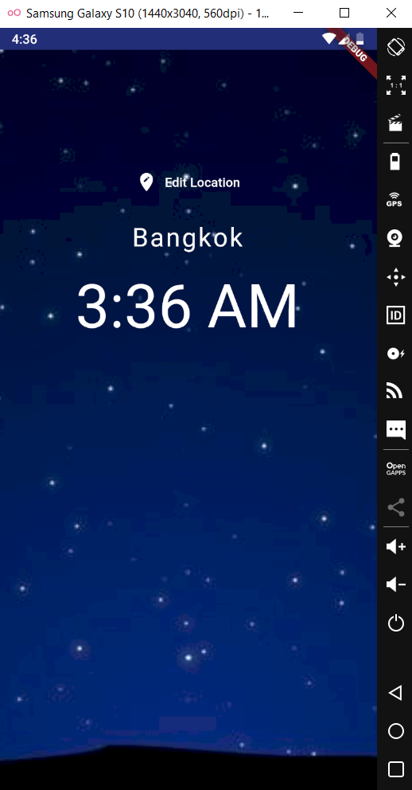
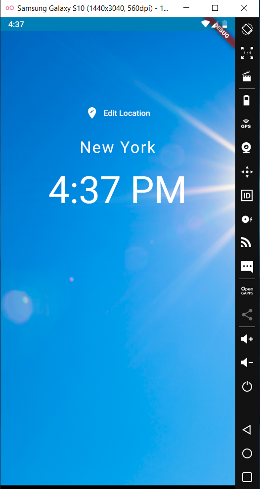

# world_time_app
simple flutter app to check world time.
this app is made by flutter with and by using the following API: WorldTimeAPI.
this app allows the user to choose a location to check the time of that location and if its morning time at that location the background will be a sunny pic and if its night then the background will be a night pic.

  
  
  
  
  

